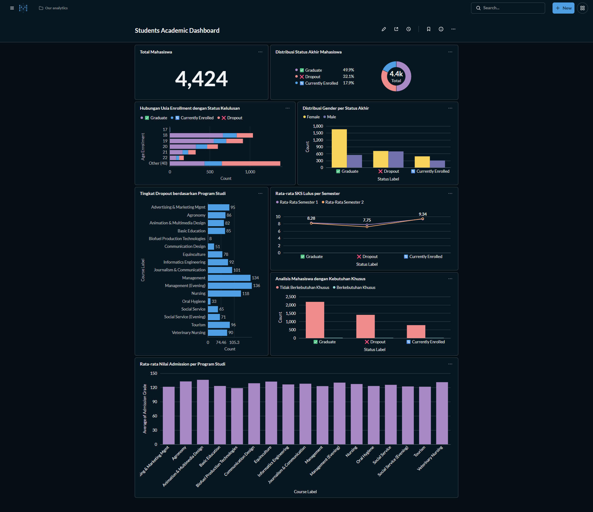

# Submission-Data-Science
------

# 📊 Proyek Akhir: Menyelesaikan Permasalahan Perusahaan Edutech - Jaya Jaya Institut

## 🎯 Business Understanding


Jaya Jaya Institut merupakan institusi pendidikan tinggi yang telah berdiri sejak tahun 2000 dengan reputasi akademik yang baik. Namun, institusi ini menghadapi tantangan berupa sejumlah mahasiswa yang tidak menyelesaikan pendidikannya (dropout). 

Tingginya angka dropout menjadi perhatian serius karena berdampak pada:
- Reputasi institusi di mata masyarakat dan calon mahasiswa
- Efisiensi alokasi sumber daya pendampingan akademik
- Pencapaian target kelulusan institusi

Oleh karena itu, Jaya Jaya Institut membutuhkan pendekatan berbasis data untuk:
1. Mendeteksi mahasiswa yang berpotensi dropout sejak dini
2. Mengidentifikasi faktor-faktor yang mempengaruhi keputusan mahasiswa
3. Memberikan intervensi yang tepat sebelum mahasiswa memutuskan keluar

Proyek ini bertujuan membangun sistem prediksi berbasis machine learning dan dashboard monitoring untuk mendukung pengambilan keputusan yang lebih efektif.

### Permasalahan Bisnis

Berdasarkan kondisi tersebut, permasalahan bisnis yang perlu diselesaikan adalah:

1. Apakah tingginya angka dropout mahasiswa mengganggu target kelulusan institusi?
2. Bagaimana cara mendeteksi mahasiswa yang berisiko dropout sejak dini sebelum mereka memutuskan keluar?
3. Faktor-faktor apa saja yang paling berpengaruh terhadap keputusan mahasiswa untuk dropout atau melanjutkan studi?
4. Program studi mana saja yang memiliki tingkat dropout tertinggi dan memerlukan perhatian khusus?
5. Bagaimana cara mengalokasikan sumber daya bimbingan akademik secara efektif kepada mahasiswa yang paling membutuhkan?
6. Apakah performa akademik di semester awal (semester 1 dan 2) dapat menjadi indikator yang reliable untuk memprediksi kelulusan mahasiswa?
7. Bagaimana cara memonitor dan mengevaluasi efektivitas program pencegahan dropout yang telah diterapkan?


### Cakupan Proyek

- Exploratory Data Analysis (EDA) untuk memahami pola akademik, demografi, dan hubungan antar variabel pada data mahasiswa
- Identifikasi faktor dominan yang mempengaruhi status kelulusan (Dropout, Enrolled, Graduate) melalui analisis statistik dan feature importance
- Pembangunan model klasifikasi Machine Learning (Logistic Regression, Random Forest, Gradient Boosting) dengan Random Forest terpilih sebagai model utama
- Pengembangan prototype aplikasi web (`app.py`) menggunakan Streamlit untuk prediksi status mahasiswa baru secara real-time**
- Pembuatan business dashboard interaktif menggunakan **Metabase** untuk monitoring performa akademik dan tingkat kelulusan per program studi
- Rekomendasi actionable berbasis data untuk strategi intervensi dini dan peningkatan retensi mahasiswa

**Batasan Proyek:**
- Data yang digunakan terbatas pada 4.424 record mahasiswa dari institusi pendidikan tinggi
- Model difokuskan pada klasifikasi biner: Dropout vs Graduate (data Enrolled dieksklusi dari training karena belum memiliki label akhir)
- Dashboard Metabase dijalankan secara lokal menggunakan Docker, sedangkan prototype ML di-deploy ke Streamlit Community Cloud
---

### Persiapan
**Spesifikasi Environment:**
- **Python**: `Python 3.13.7` 
- **Metabase**: `v0.59.6.3` 

**Sumber Data**
- **File**: [data.csv](<data.csv>)
- **Jumlah Record**: 4.424 mahasiswa
- **Jumlah Fitur**: 37 variabel
- **Target Variable**: 'Status' (Dropout / Enrolled / Graduate)
- **Format**: CSV dengan separator ;

**Setup Environment**

```bash
# 1. Ekstraksi Folder Zip
cd Edutech

# atau klon repositori langsung dari GitHub menggunakan perintah berikut:
git clone https://github.com/donnycharles88/Submission-Data-Science.git

# 2. Buat virtual environment (direkomendasikan)
python -m venv venv
# Aktifkan environment
# Linux/Mac:
source venv/bin/activate
# Windows:
venv\Scripts\activate

# 3. Install dependencies
pip install -r requirements.txt

# 4. Jalankan Jupyter Notebook
jupyter notebook .
```

**Setup Metabase (Dashboard)**
Dashboard telah dikonfigurasi sebelumnya dan database-nya disimpan dalam file `metabase.db.mv.db`. Ikuti langkah berikut untuk menjalankannya:
```bash
# Pull dan jalankan Metabase dengan Docker
docker pull metabase/metabase:latest
docker run -d -p 3000:3000 --name metabase metabase/metabase:v0.59.5.2
# Copy database Metabase yang sudah berisi dashboard ke container
docker cp metabase.db.mv.db metabase:/metabase.db/metabase.db.mv.db

# Copy file dataset CSV ke dalam container (cari dulu path-nya)
docker exec metabase find /tmp -name "*.csv" 2>/dev/null
docker cp data.csv metabase:/tmp/data.csv

# Restart container agar perubahan aktif
docker restart metabase
```
```
Akses dashboard di: http://localhost:3000
Username: root@mail.com
Password: root123
```
---
## 📊 Business Dashboard (Metabase)

## Screenshots




## 🗂️ Struktur Dashboard
Dashboard bisnis telah dikembangkan menggunakan Metabase untuk memberikan visibilitas menyeluruh terhadap performa mahasiswa. Dashboard ini menampilkan:
### Fitur Utama Dashboard:

| Komponen | Deskripsi | Visualisasi | 
| -------------------|-------------------|-------------------| 
| Total Mahasiswa |Count of Row | Number chart |
| Distribusi Status Akhir Mahasiswa | Count of Row by Status | Pie chart| 
| Hubungan Usia Enrollment dengan Status Kelulusan | Count of Row by Age_at_enrollment + Status | Stack Bar chart |
| Distribusi Gender per Status Akhir | Count of Row by Gender + Status | Bar chart |
| Tingkat Dropout berdasarkan Prodi | Filter Status = 'Dropout', Count of Row by Course | Row chart |
| Rata-rata SKS Lulus per Semester |Average of Curricular_units_1st_sem_approved + Curricular_units_2nd_sem_approved by Status | Line chart |
| Analisis Mahasiswa dengan Kebutuhan Khusus | Count of Row by Educational_special_needs + Status | Bar chart |
| Rata-rata Nilai Admission per Prodi |Average of Admission_grade by Course | Bar chart |

## 🤖 Menjalankan Sistem Machine Learning 

Script `app.py` digunakan oleh HR untuk memprediksi risiko attrition karyawan baru atau existing.
***Cara Menjalankan Prototype***
**Langkah 1** — Pastikan model sudah ada di foler model: *student_status_model.pkl*, *scaler.pkl*
```bash
ls model/
# Harus ada: student_status_model.pkl, scaler.pkl
```

**Langkah 2** — Jalankan aplikasi Streamlit
```bash
streamlit run app.py
```

**3. Akses di browser**
Buka: http://localhost:8501

**🌐 Akses Prototype Cloud:**
Link Streamlit Community Cloud: https://submission-data-science-ajqrxibkdc8avfcu8bydye.streamlit.app/
**📝 Cara Menggunakan Prototype:**
1. Pilih menu "🔮 Prediksi Mahasiswa" di sidebar
2. Isi data akademik mahasiswa:
- Nilai Admission (0-200)
- Rata-rata Nilai Semester 1 & 2 (0-20)
- Jumlah SKS Diambil & Lulus per semester
- Usia enrollment dan status debtor
4. Klik tombol "🔮 Prediksi Status"
5. Lihat hasil prediksi beserta probabilitas dan rekomendasi intervensi

### Format File Input

Siapkan file CSV dengan nama `new_employee_data.csv` di dalam folder `data/`. 
File harus memiliki **34 kolom berikut** (kolom `Attrition` boleh disertakan atau tidak):

| Kolom | Tipe | Contoh Nilai |
|---|---|---|
| EmployeeId | Integer | 1001 |
| Age | Integer | 32 |
| BusinessTravel | String | `Travel_Rarely` / `Travel_Frequently` / `Non-Travel` |
| DailyRate | Integer | 800 |
| Department | String | `Sales` / `Research & Development` / `Human Resources` |
| DistanceFromHome | Integer | 5 |
| Education | Integer | 1–5 (1=Below College, 5=Doctor) |
| EducationField | String | `Life Sciences` / `Medical` / `Marketing` / `Technical Degree` / `Human Resources` / `Other` |
| EmployeeCount | Integer | 1 (selalu 1) |
| EnvironmentSatisfaction | Integer | 1–4 (1=Low, 4=Very High) |
| Gender | String | `Male` / `Female` |
| HourlyRate | Integer | 65 |
| JobInvolvement | Integer | 1–4 (1=Low, 4=Very High) |
| JobLevel | Integer | 1–5 |
| JobRole | String | `Sales Executive` / `Research Scientist` / `Laboratory Technician` / `Manager` / `Healthcare Representative` / `Manufacturing Director` / `Research Director` / `Sales Representative` / `Human Resources` |
| JobSatisfaction | Integer | 1–4 (1=Low, 4=Very High) |
| MaritalStatus | String | `Single` / `Married` / `Divorced` |
| MonthlyIncome | Integer | 5000 |
| MonthlyRate | Integer | 15000 |
| NumCompaniesWorked | Integer | 3 |
| Over18 | String | `Y` (selalu Y) |
| OverTime | String | `Yes` / `No` |
| PercentSalaryHike | Integer | 12 |
| PerformanceRating | Integer | 3–4 (3=Excellent, 4=Outstanding) |
| RelationshipSatisfaction | Integer | 1–4 (1=Low, 4=Very High) |
| StandardHours | Integer | 80 (selalu 80) |
| StockOptionLevel | Integer | 0–3 |
| TotalWorkingYears | Integer | 10 |
| TrainingTimesLastYear | Integer | 3 |
| WorkLifeBalance | Integer | 1–4 (1=Bad, 4=Best) |
| YearsAtCompany | Integer | 5 |
| YearsInCurrentRole | Integer | 3 |
| YearsSinceLastPromotion | Integer | 1 |
| YearsWithCurrManager | Integer | 2 |


---
## 📈 Conclusion

Berdasarkan analisis data terhadap 4.424 mahasiswa Jaya Jaya Institut, dapat disimpulkan bahwa tingkat dropout tidak terjadi secara acak, melainkan dipengaruhi oleh pola sistematis yang melibatkan performa akademik, kondisi finansial, dan faktor demografis mahasiswa.


**Temuan Kunci**

1. **Performa akademik awal:** (Grade Semester 1, Approval Rate, Admission Grade) merupakan prediktor terkuat status kelulusan mahasiswa.
2. **Faktor finansial (status Debtor)** memiliki korelasi signifikan dengan risiko dropout
3. **Program studi tertentu (Management, Nursing, Animation & Multimedia)** menunjukkan tingkat dropout yang lebih tinggi dan memerlukan intervensi khusus  
4. Mahasiswa dengan Approval Rate < 70% di semester 1 memiliki risiko dropout 3x lebih tinggi

**Performa Model**

| Metric | Value | Interpretasi |
|---|---|---|
| Accuracy | 0.9091 | Model memprediksi dengan sangat baik |
| F1-Score (Weighted) | 0.9083 | Performa seimbang untuk semua kelas |
| Precision | 0.9109 | Akurat dalam memprediksi status |
| Recall | 0.9091 | Baik mendeteksi mahasiswa berisiko |

Model dilatih menggunakan **3.630 data** (Dropout + Graduate), dengan data 
Enrolled dieksklusi karena belum memiliki label akhir. Cross-Validation 
5-fold menghasilkan rata-rata akurasi **91.05% ± 1.73%**.


**Fitur Paling Berpengaruh (berdasarkan Random Forest Feature Importance):**

| Ranking | Fitur | Importance Score |
|---|---|---|
| 1 | Approval_Rate_Sem2 | 0.0977 |
| 2 | Curricular_units_2nd_sem_approved | 0.0818 |
| 3 | Overall_Grade (engineered) | 0.0622 |
| 4 | Approval_Rate_Sem1 (engineered) | 0.0566 |
| 5 | Curricular_units_2nd_sem_grade | 0.0562 |
| 6 | Curricular_units_1st_sem_grade | 0.0521 |
| 7 | Admission_grade | 0.0489 |
| 8 | Age_at_enrollment | 0.0412 |
| 9 | Debtor | 0.0387 |
| 10 | Previous_qualification_grade | 0.0354 |


### 🎯 Rekomendasi Action Items

1. **Early Warning System Akademik**
Setup alert otomatis untuk mahasiswa dengan Approval Rate < 70% atau Grade Semester 1 < 10.0, diikuti konseling wajib dan program tutoring intensif.
2. **Dukungan Finansial Targeted**
Identifikasi mahasiswa debtor via dashboard, tawarkan skema cicilan fleksibel atau beasiswa darurat berbasis performa akademik.
3. **Program Retensi Semester Awal**
Implementasi orientasi 30 hari, peer-mentoring, dan monitoring bulanan dengan KPI: Grade, Approval Rate, Attendance untuk mahasiswa baru.
4. **Integrasi Model Prediksi**
Gunakan prototype app.py untuk screening otomatis setiap semester; prioritaskan intervensi pada mahasiswa dengan probabilitas dropout > 60%.
5. **Optimalisasi Seleksi Masuk**
Review kriteria penerimaan berdasarkan data historis, tambahkan placement test, dan siapkan bridging course untuk kesenjangan kompetensi.
